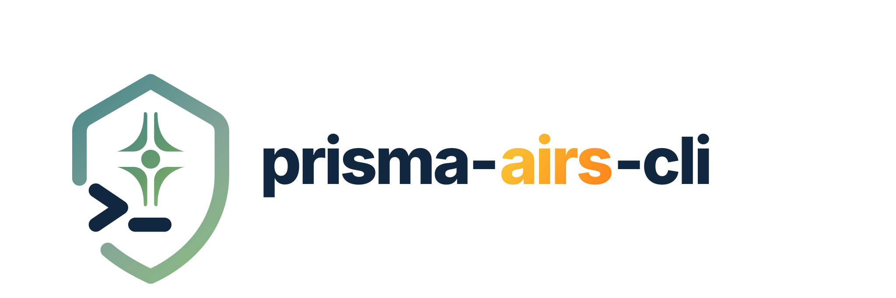

<p align="center">
  <picture>
    <source media="(prefers-color-scheme: dark)" srcset="docs-site/static/img/logo-wordmark-dark.svg">
    
  </picture>
</p>

[](https://github.com/cdot65/prisma-airs-cli/actions/workflows/ci.yml)
[](https://www.npmjs.com/package/@cdot65/prisma-airs-cli)
[](https://opensource.org/licenses/MIT)
[](https://nodejs.org/)

**Full operational coverage over Palo Alto Prisma AIRS AI security — guardrail refinement, runtime scanning, AI red teaming, and model security.**

> **[Read the full documentation](https://cdot65.github.io/prisma-airs-cli/)** — installation, configuration, architecture, CLI reference, and examples.

## Features

- **Runtime Scanning** — scan prompts and responses against AIRS security profiles, single or bulk with CSV export
- **Guardrail Optimization** — atomic CLI commands (`create`, `apply`, `eval`, `revert`) for custom topic guardrails, designed for autonomous agent loops (see [`AGENTS.md`](AGENTS.md))
- **AI Red Teaming** — adversarial scanning with static, dynamic, and custom prompt set attack modes
- **Model Security** — ML model supply chain scanning with security groups, rules, and violation tracking

## Install

```bash
npm install -g @cdot65/prisma-airs-cli
airs --version
```

Requires **Node.js >= 20**. Also available via `pnpm add -g`, `npx`, or as a [Docker image](https://github.com/cdot65/prisma-airs-cli/pkgs/container/prisma-airs-cli). See the [installation guide](https://cdot65.github.io/prisma-airs-cli/getting-started/installation/) for details.

## Quick Start

```bash
# Configure credentials
cp .env.example .env   # add your API keys

# Runtime scanning
airs runtime scan --profile "my-profile" "Is this prompt safe?"
airs runtime bulk-scan --profile "my-profile" --input prompts.csv --output results.csv

# Guardrail optimization (atomic commands)
airs runtime topics create --topic "Block bomb-making" --intent block
airs runtime topics apply --profile my-profile --topic "Block bomb-making"
airs runtime topics eval --profile my-profile --input prompts.csv
airs runtime topics revert --profile my-profile --topic "Block bomb-making"

# Red team scanning
airs redteam scan --target <uuid> --name "Full Scan" --type STATIC
airs redteam report <job-id>

# Model security
airs model-security scans create --config scan-config.json
```

## Documentation

The full guides, complete CLI reference, configuration, and architecture live on the **[documentation site](https://cdot65.github.io/prisma-airs-cli/)**:

- **[Getting Started](https://cdot65.github.io/prisma-airs-cli/getting-started/installation/)** — install, configure credentials, run your first scan
- **[Runtime Security](https://cdot65.github.io/prisma-airs-cli/runtime/overview/)** — scanning, profiles, topics, and DLP management
- **[Guardrail Optimization](https://cdot65.github.io/prisma-airs-cli/runtime/guardrails/overview/)** — the agent-driven `topics create/apply/eval/revert` loop
- **[AI Red Teaming](https://cdot65.github.io/prisma-airs-cli/redteam/overview/)** — static, dynamic, and custom adversarial scans
- **[Model Security](https://cdot65.github.io/prisma-airs-cli/model-security/overview/)** — ML model supply-chain scanning
- **[CLI Reference](https://cdot65.github.io/prisma-airs-cli/cli/)** — every command, flag, and example

## Configuration

Credentials come from environment variables or `~/.prisma-airs/config.json`. At minimum: `PANW_AI_SEC_API_KEY` (scanning) and `PANW_MGMT_CLIENT_ID` / `PANW_MGMT_CLIENT_SECRET` / `PANW_MGMT_TSG_ID` (management). See [`.env.example`](.env.example) and the [configuration guide](https://cdot65.github.io/prisma-airs-cli/getting-started/configuration/) for the full list.

## License

MIT
