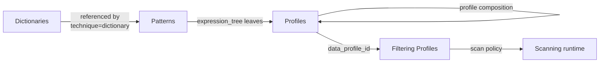

# DLP

`airs runtime dlp` is full CRUD over the four configuration surfaces of the Palo Alto Networks DLP service: data **filtering profiles**, **patterns**, **profiles**, and **dictionaries**. Twenty commands, one shared OAuth token cache, one merge-patch UX across every resource that supports PATCH.

- **[Filtering Profiles](filtering-profiles.md)** — Bind data profiles to scan policy (file vs non-file, log severity, direction). Read + full-replace only; no create or delete.
- **[Patterns](patterns.md)** — Detection primitives: regex, weighted_regex, dictionary, EDM, classifier. Full CRUD; `delete` is soft (archive).
- **[Profiles](profiles.md)** — Boolean compositions via `expression_tree` / `multi_profile`. No supported DELETE; lifecycle retirement remains unverified after live HTTP 500/501 failures.
- **[Dictionaries](dictionaries.md)** — Keyword lists for `dictionary`-technique detection. Multipart upload (metadata + keyword file). PUT may return 200 or 204.

## Authentication

DLP reuses the AIRS Management OAuth2 credentials — no DLP-specific tokens. Starting
with **CLI 5.7.1**, all DLP CRUD commands resolve the selected tenant's JSON configuration,
including its OAuth token and DLP endpoint overrides. No credential environment variables
are required when using a named tenant. Conflicting `PANW_*` overrides fail before a request
is sent. The SDK client shares a token cache within one CLI process.

CLI 5.7.0 and earlier bypassed tenant configuration in these commands and could report
`AISEC_MISSING_VARIABLE:clientId is required` despite valid tenant credentials. Upgrade
instead of exporting secrets as a workaround. Version 5.7.1 also fixes structured output
selection for DLP create, replace, and patch commands.

If a migration stopped at this error, [resume without losing the existing evidence](tenant-auth-recovery.md).

```bash
npm install --global @cdot65/prisma-airs-cli@5.7.1
airs tenant list
airs runtime dlp patterns list --output json
airs runtime dlp profiles list --output json
```

For legacy/default configuration, the equivalent environment settings are:

| Variable | Required | What it does |
|----------|:--------:|--------------|
| `PANW_MGMT_CLIENT_ID` | Unless configured in JSON | OAuth2 client ID |
| `PANW_MGMT_CLIENT_SECRET` | Unless configured in JSON | OAuth2 client secret |
| `PANW_MGMT_TSG_ID` | Unless configured in JSON | Tenant Service Group ID |
| `PANW_DLP_ENDPOINT` | -- | Override default DLP base URL (`api.dlp.paloaltonetworks.com`) |

See [Environment Variables](../../reference/environment-variables.md) for the full list.

## Command map

All twenty commands at a glance:

| Resource | list | create | get | replace | patch | delete |
|----------|:----:|:------:|:---:|:-------:|:-----:|:------:|
| [filtering-profiles](filtering-profiles.md) | ✅ | — | ✅ | ✅ | — | — |
| [patterns](patterns.md) | ✅ | ✅ | ✅ | ✅ | ✅ | ✅ soft |
| [profiles](profiles.md) | ✅ | ✅ | ✅ | ✅ | ✅ | stub (exits 2) |
| [dictionaries](dictionaries.md) | ✅ | ✅ multipart | ✅ | ✅ multipart | ✅ | ✅ |

:::note[Why the gaps]
`filtering-profiles` and `profiles` contracts do not expose DELETE. `profiles delete <id>` is a stub that explains the cleanup limitation and exits 2 without API traffic. The September 6 profile status-patch attempt returned 500, and an advertised DELETE returned 501. Pattern deletion was verified separately: the entry remains readable with `status: "deleted"`.
:::

## Resource model



Build bottom-up: dictionaries → patterns → profiles → filtering profiles. Soft-delete top-down: profiles archived before patterns; filtering profiles unbind via `data_profile_id`.

## Shared patch UX

All PATCH-capable resources (`patterns`, `profiles`, `dictionaries`) accept the same three input modes — pick whichever fits the shape of your change:

| Mode | When to use | Mutex with |
|------|-------------|------------|
| `--set k=v` (repeatable) | Scalar field tweaks. Values coerce: `true`/`false`, numbers, JSON literals. Quote `'"5"'` to force string-5. `null` rejected — use `--clear` | `--body-file` |
| `--clear k` (repeatable) | Send merge-patch `null` to clear a field | `--body-file` |
| `--body-file <path>` | Nested fields (`detection_rules`, `matching_rules`, etc.). Full JSON merge-patch body, RFC 7396 | `--set` / `--clear` |

**Required fields on patch** vary per resource — merge-patch is RFC 7396 (omit-to-preserve), but the DLP API enforces presence on a small set even when unchanged:

| Resource | Required on every PATCH |
|----------|-------------------------|
| `patterns` | `name`, `type`, `detection_config` |
| `profiles` | `name`, `profile_type` |
| `dictionaries` | `name`, `category`, `original_file_name` |

If you patch anything else, include the required fields via `--set` as well.

## Common gotchas

- **Quote string-5 in `--set`**: `--set count='"5"'` to force a JSON string. `--set count=5` becomes a number; `--set count=true` becomes a boolean.
- **`--set k=null` is rejected** — use `--clear k` instead (the CLI catches this and errors before sending).
- **`profiles delete` is a stub** — exits 2 without HTTP traffic. The historical status-patch idiom below is not verified cleanup; it returned HTTP 500 in the latest owned-fixture test:

    ```bash
    airs runtime dlp profiles patch <id> --body-file - <<'EOF'
    { "name": "my-profile", "profile_type": "advanced", "profile_status": "deleted" }
    EOF
    ```

- **`dictionaries replace` may return 204** — region-dependent. CLI re-GETs on 204; if that fails, it prints `replaced <id> (state not echoed by region)`. Always `get --keywords` after replace to canonically observe state.
- **`dictionaries create/replace` are multipart** — `--file` is required for both. Metadata via flat flags or `--metadata-file`. Never set `Content-Type` manually.
- **Patterns `delete` is soft** — archived server-side, invisible to `list`, still resolvable via `get` with `status: "deleted"`.
- **Filtering profiles have no `create`** — provision new profiles in the Strata Cloud Manager UI, then manage them via CLI.

## See also

- [Filtering Profiles](filtering-profiles.md) · [Patterns](patterns.md) · [Profiles](profiles.md) · [Dictionaries](dictionaries.md)
- [Configuration Management](../config-management.md) — non-DLP runtime config CRUD
- [Environment Variables](../../reference/environment-variables.md)
