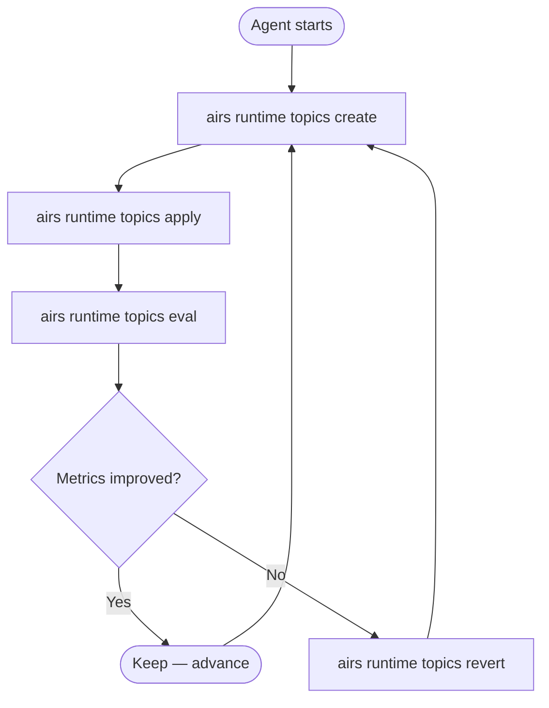

# Guardrail Optimization

The guardrail workflow was refactored from an embedded LLM-driven async generator loop to a set of atomic CLI commands. An external agent (Claude Code, Gemini CLI, etc.) orchestrates these commands in a loop following the protocol defined in `program.md`.

## Atomic Commands

The four commands form a create-apply-eval-revert cycle:

| Command | What it does |
|---------|-------------|
| `topics create` | Create or update a custom topic definition (validates AIRS constraints, upserts by name) |
| `topics apply` | Assign a topic to a security profile (additive, preserves existing topics) |
| `topics eval` | Scan a static CSV prompt set against the profile, compute metrics (TPR, TNR, coverage, F1), return FP/FN details |
| `topics revert` | Remove topic from profile and delete the topic definition |

## Agent Loop Protocol

The external agent follows `program.md`:

1. Establish baseline by running `eval` on the unmodified profile
2. Create/update a topic definition
3. Apply it to the profile
4. Evaluate against the prompt set
5. If metrics improve, keep the change; if they regress, revert
6. Repeat indefinitely until interrupted

## Key Design Decisions

- **No embedded LLM** — the CLI is stateless; the agent provides all intelligence
- **No cross-run memory** — the agent maintains its own context
- **No run persistence** — no `RunState` JSON files; the agent tracks state externally
- **Atomic operations** — each command succeeds or fails independently, making the workflow recoverable at any point

## Topic Name Locking

The topic name is used as the upsert key. The `create` command validates AIRS constraints:

| Constraint | Limit |
|-----------|-------|
| Topic name | 100 characters |
| Description | 250 characters |
| Each example | 250 characters |
| Max examples | 5 |
| Combined (description + all examples) | 1000 characters |

## Related

- [Metrics & Evaluation](../runtime/guardrails/metrics.md) — how TP/TN/FP/FN are classified
- [Topic Constraints](../runtime/guardrails/topic-constraints.md) — AIRS limits on topic definitions
- `program.md` — full agent loop protocol
