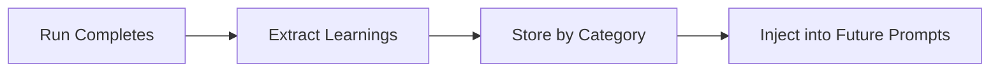

# Memory System

Prisma AIRS CLI learns from every run. After a guardrail generation completes, the system extracts insights and stores them for future runs on similar topics. Over time, this means faster convergence and fewer iterations.



## How Learnings Work

After each run, the `LearningExtractor` sends the full iteration history to the LLM. The LLM produces structured insights:

| Field | What it is |
|-------|-----------|
| `insight` | An actionable observation (e.g., "Specific action verbs in examples improve detection") |
| `strategy` | How to apply it next time |
| `outcome` | `improved`, `degraded`, or `neutral` |
| `changeType` | What was changed: `description-only`, `examples-only`, `both`, or `initial` |
| `corroborations` | How many runs have confirmed this learning |
| `tags` | Metadata for filtering and display |

!!! info "Corroboration"
    When a new run rediscovers an existing insight, the corroboration count goes up instead of creating a duplicate. Higher corroboration = higher priority when injecting into prompts.

---

## Topic Categorization

Learnings are organized by keyword-based categories derived from the topic description:

1. Lowercase the description
2. Strip punctuation
3. Remove stop words (the, a, and, etc.)
4. Sort remaining words alphabetically
5. Join with hyphens

**Example:** `"Block weapons discussions"` becomes `block-discussions-weapons`

Each category gets its own file on disk.

---

## Cross-Topic Transfer

Here's where memory gets powerful: learnings transfer to _related_ topics, not just exact matches.

Any topic whose keywords have **50% or more overlap** with a stored category receives those learnings.

!!! example "How transfer works"
    Learnings from `"Block weapons discussions"` (`block-discussions-weapons`) automatically transfer to `"Block violence and weapons"` (`block-violence-weapons`) — the keyword overlap exceeds 50%.

---

## Budget-Aware Injection

Learnings are injected into LLM prompts within a character budget (default **3000 chars**, configurable 500--10000). They're sorted by corroboration count and rendered in three tiers:

### Tier 1 — Full Detail
When budget allows, include metadata:
```
- [DO] Use specific action verbs in examples (description-only, seen 4x)
- [AVOID] Overly generic descriptions that match benign prompts (both, seen 3x)
```

### Tier 2 — Compact
When space is tight, insight only:
```
- [DO] Use specific action verbs in examples
- [AVOID] Overly generic descriptions that match benign prompts
```

### Tier 3 — Omitted
When even compact doesn't fit:
```
(+5 more learnings omitted)
```

!!! note
    Anti-patterns are appended after learnings if remaining budget allows.

---

## Best-Known Tracking

The memory store keeps the best topic definition and metrics for each category. If a new run produces worse results, the previous best is preserved — you never lose your best configuration.

## Storage

All memory files live at:

```
~/.prisma-airs/memory/{category}.json
```

Each file contains the learnings array, best-known topic definition, and best-known metrics for that category. Files are human-readable JSON.
