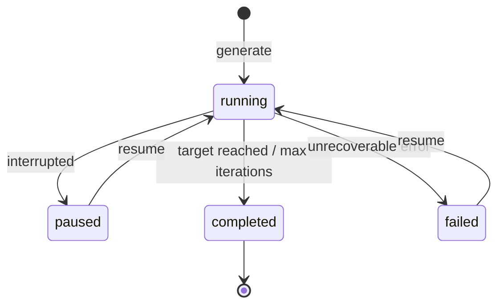

# Resumable Runs

Runs checkpoint after every iteration. If something goes wrong — network error, rate limit, or you just hit Ctrl+C — pick up right where you left off. No wasted API calls.

## Run Lifecycle



| Status | Meaning |
|--------|---------|
| `running` | Loop is actively iterating |
| `paused` | Interrupted (Ctrl+C or signal) |
| `completed` | Coverage target reached or max iterations used |
| `failed` | Unrecoverable error during an iteration |

!!! info
    Only `paused` and `failed` runs can be resumed. Completed runs are final.

---

## What Gets Saved

Full run state is written to disk after each iteration at `~/.prisma-airs/runs/{runId}.json`:

| Field | What it is |
|-------|-----------|
| `runId` | Unique identifier for this run |
| `status` | Current lifecycle status |
| `userInput` | Your original configuration (topic, intent, provider, etc.) |
| `iterations` | All completed iteration results with metrics |
| `bestIteration` | Index of the iteration with highest coverage |
| `currentTopic` | The latest topic definition |
| `createdAt` / `updatedAt` | Timestamps |

!!! tip
    Because state is saved after _every_ iteration, you never lose more than the current in-progress iteration on failure.

---

## Resuming

```bash
airs runtime topics resume <runId>
```

The resumed run continues with:

- The same topic name (locked after iteration 1)
- The latest topic definition from the last completed iteration
- Full iteration history for LLM context
- Inherited settings (including `accumulateTests`) from the original `UserInput`

### Add More Iterations

```bash
# Resume with up to 10 more iterations from current position
airs runtime topics resume abc123 --max-iterations 10
```

---

## Viewing Results

### List All Runs

```bash
airs runtime topics runs
```

Summary table with run ID, status, topic name, iterations completed, best coverage, and timestamps.

### View a Specific Run

```bash
# Best iteration (highest coverage)
airs runtime topics report <runId>

# A specific iteration
airs runtime topics report <runId> --iteration 3
```

Shows topic definition, test results, metrics, and analysis for the selected iteration.
